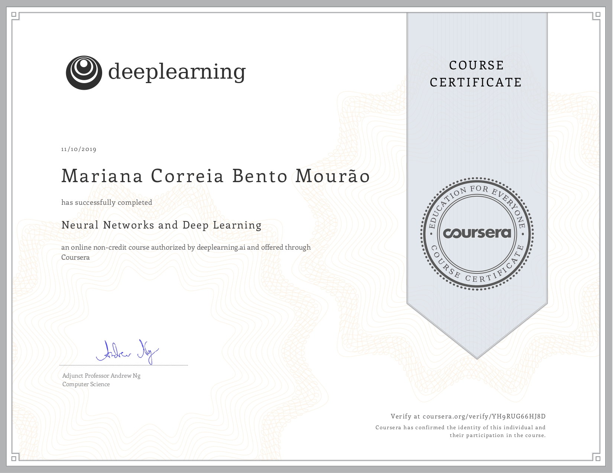
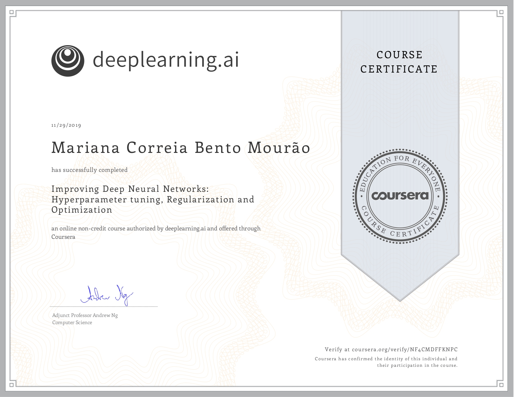

# Deep-Learning-ia.deeplearning-Specialization

In this repository, the projects completed for the first 3 courses integrated on the [Deep Learning Specialization offered by ia.deeplearning on Coursera](https://www.coursera.org/specializations/deep-learning) are made available, which comprises 5 courses in total. It was intended to have a more general introduction to the Deep Learning field, being the remaining 2 courses more specialized ([Convolutional Neural Networks](https://www.coursera.org/learn/convolutional-neural-networks?specialization=deep-learning) and [Sequence Models](https://www.coursera.org/learn/nlp-sequence-models)). 

The completed courses included graded quizzes and guided projects (consisting of completing code blocks left blank), but only the guided projects are made available. 

# Guided Projects 

- Course 1: [Neural Networks and Deep Learning](https://www.coursera.org/learn/neural-networks-deep-learning?specialization=deep-learning)
  - [Logistic Regression with a Neural Network mindset](https://github.com/marianamourao-37/Deep-Learning---ia.deeplearning-Specialization/blob/master/Neural%20Networks%20and%20Deep%20Learning/Logistic_Regression_with_a_Neural_Network_mindset_v6a.ipynb)
  - [Planar data classification with one hidden layer](https://github.com/marianamourao-37/Deep-Learning---ia.deeplearning-Specialization/blob/master/Neural%20Networks%20and%20Deep%20Learning/Planar_data_classification_with_onehidden_layer_v6c.ipynb)
  - [Deep Neural Network for Image Classification: Application](https://github.com/marianamourao-37/Deep-Learning---ia.deeplearning-Specialization/blob/master/Neural%20Networks%20and%20Deep%20Learning/Deep%2BNeural%2BNetwork%2B-%2BApplication%2Bv8.ipynb)
  
- Course 2: [Improving Deep Neural Networks: Hyperparameter tuning, Regularization and Optimization](https://www.coursera.org/learn/deep-neural-network?specialization=deep-learning)
  - [Initialization](https://github.com/marianamourao-37/Deep-Learning---ia.deeplearning-Specialization/blob/master/Improving%20Deep%20Neural%20Networks%20Hyperparameter%20tuning%2C%20Regularization%20and%20Optimization/Initialization.ipynb)
  - [Regularization](https://github.com/marianamourao-37/Deep-Learning---ia.deeplearning-Specialization/blob/master/Improving%20Deep%20Neural%20Networks%20Hyperparameter%20tuning%2C%20Regularization%20and%20Optimization/Regularization_v2a.ipynb)
  - [Gradient Checking](https://github.com/marianamourao-37/Deep-Learning---ia.deeplearning-Specialization/blob/master/Improving%20Deep%20Neural%20Networks%20Hyperparameter%20tuning%2C%20Regularization%20and%20Optimization/Gradient%2BChecking%2Bv1.ipynb)
  - [Optimization Methods](https://github.com/marianamourao-37/Deep-Learning---ia.deeplearning-Specialization/blob/master/Improving%20Deep%20Neural%20Networks%20Hyperparameter%20tuning%2C%20Regularization%20and%20Optimization/Optimization_methods_v1b.ipynb)
  - [TensorFlow Tutorial](https://github.com/marianamourao-37/Deep-Learning---ia.deeplearning-Specialization/blob/master/Improving%20Deep%20Neural%20Networks%20Hyperparameter%20tuning%2C%20Regularization%20and%20Optimization/TensorFlow_Tutorial_v3b.ipynb)
  
- Course 3: [Structuring Machine Learning Projects](https://www.coursera.org/learn/machine-learning-projects?specialization=deep-learning)
  - There is no Guided Project for this course, only including case study quizzes.

# Certificates

